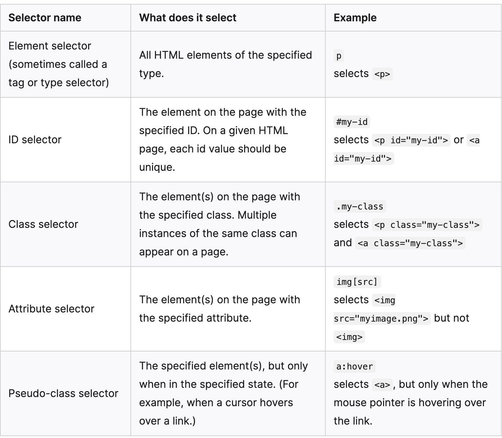

# CSS Basics

## What is CSS?
CSS (Cascading Style Sheets) is the code that styles web content.

Like HTML, CSS is not a programming language. It's not a markup language either. CSS is a style sheet language. CSS is what you use to selectively style HTML elements. For example, this CSS selects paragraph text, setting the color to red:

    p {
        color: red;
    }

## Anatomy of a CSS ruleset

The whole structure is called a ruleset. (The term ruleset is often referred to as just rule.) Note the names of the individual parts:

### Selector
This is the HTML element name at the start of the ruleset. It defines the element(s) to be styled (in this example, 
 elements). To style a different element, change the selector.

### Declaration
This is a single rule like color: red;. It specifies which of the element's properties you want to style.

### Properties
These are ways in which you can style an HTML element. (In this example, color is a property of the 
 elements.) In CSS, you choose which properties you want to affect in the rule.

### Property value
To the right of the property—after the colon—there is the property value. This chooses one out of many possible appearances for a given property. (For example, there are many color values in addition to red.)

Note the other important parts of the syntax:

1. Apart from the selector, each ruleset must be wrapped in curly braces. ({})
2. Within each declaration, you must use a colon (:) to separate the property from its value or values.
3. Within each ruleset, you must use a semicolon (;) to separate each declaration from the next one.

To modify multiple property values in one ruleset, write them separated by semicolons, like this:

    p {
        color: red;
        width: 500px;
        border: 1px solid black;
    }

## Selecting multiple elements
You can also select multiple elements and apply a single ruleset to all of them. Separate multiple selectors by commas. For example:

    p,
    li,
    h1 {
    color: red;
    }

Above style will be applied to all the paragraphs, list and h1 elements contents.

## Different types of selectors

## Fonts and text
[Font, Color & Font Families](https://developer.mozilla.org/en-US/docs/Learn/CSS/Styling_text/Fundamentals)

## Html Usage
CSS can be added to HTML documents in 3 ways:

1. `Inline` - by using the style attribute inside HTML elements. An inline CSS is used to apply a unique style to a single HTML element.
2. `Internal` - by using a <style> element in the <head> section. An internal CSS is used to define a style for a single HTML page.
3. `External` - by using a <link> element to link to an external CSS file. An external style sheet is used to define the style for many HTML pages.

The most common way to add CSS, is to keep the styles in external CSS files. However, in this tutorial we will use inline and internal styles, because this is easier to demonstrate, and easier for you to try it yourself.

## References
1. [Learn CSS - MDN Docs]()
2. [W3School CSS](https://www.w3schools.com/html/html_css.asp)