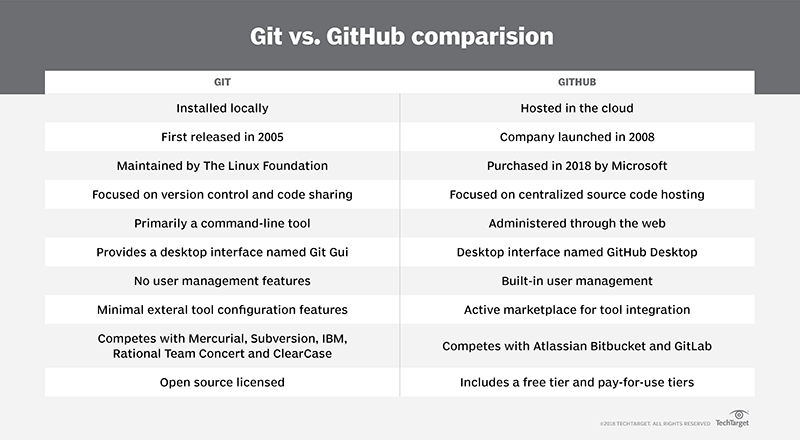

# What is Source Control Manager (SCM)

>Please follow [this](https://www.coursera.org/learn/introduction-to-version-control?specialization=meta-front-end-developer) course.

Source control is also referred as the Version Control System (VCS). Source control (or version control) is the practice of tracking and managing changes to code. few of the Source control management (SCM) benefits :-

    Allows you to track your code change(s)
    Provides a running history of code development
    Helps to resolve conflicts when merging contributions from multiple sources.
    Allows to collaborate on code with your team
    Quickly trouble-shoot issues by identifying who made changes and what the changes were
    Revert to previous versions of a project when needed

Below are few important links to see the details around importance of the source/version control system.

    https://aws.amazon.com/devops/source-control/
    https://www.atlassian.com/git/tutorials/source-code-management

Over the period of time many such systems came (listed below) but the mostly used one as of today is GitHub.
At the heart of GitHub is an open source version control system (VCS) called Git. Git is responsible for everything GitHub-related that happens locally on your computer.

There are mainly three types of version control systems.

1. Local Version Control Systems
2. Centralized Version Control Systems
3. Distributed Version Control Systems

You can also read more info [here](https://www.w3docs.com/learn-git/version-control-system.html).

## What is Git?

Git is an open-source distributed source code management system. Git allows you to create a copy of your repository known as a branch. Using this branch, you can then work on your code independently from the stable version of your codebase. Once you are ready with your changes, you can store them as a set of differences, known as a commit. You can pull in commits from other contributors to your repository, push your commits to others, and merge your commits back into the main version of the repository.  To learn more about Git, go [here](https://git-scm.com
).

## What is Github?
GitHub is a web-based interface that uses Git, the open source version control software that lets multiple people make separate changes to web pages at the same time.
Please create your account [here](https://github.com/).

## Git Vs Github

## Some Useful Links
1. https://andersenlab.org/dry-guide/2022-03-09/github/
2. https://www.theserverside.com/video/Git-vs-GitHub-What-is-the-difference-between-them

## Additional Resources

[About Version Control](https://git-scm.com/book/en/v2/Getting-Started-About-Version-Control)

[List of Version Control Software](https://en.wikipedia.org/wiki/List_of_version-control_software)

[The benefits of a distributed version control system](https://about.gitlab.com/topics/version-control/benefits-distributed-version-control-system/)

[What is Cloning?](https://docs.github.com/en/repositories/creating-and-managing-repositories/cloning-a-repository)