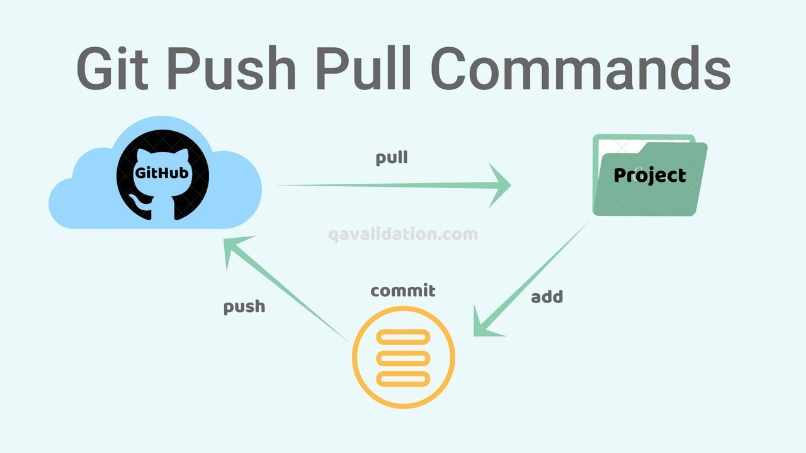

# Basic Introduction of Git

## Installing Git
> You must install git to use and create an account on Github. Check out this intro guide [here](https://docs.gitlab.com/ee/gitlab-basics/start-using-git.html).

## Key Terminologies

### Repository
Git at its core work on ```Repositories```. A Git repository tracks and saves the history of all changes made to the files in a Git project. It saves this data in a directory called `.git` , also known as the repository folder. 


### Branch
A branch in Git is simply a lightweight movable pointer to one of the commits. The default branch name in Git is `master` or `main`. As you start making commits, you’re given a master/main branch that points to the last commit you made. Every time you commit, the master branch pointer moves forward automatically.


### Git Branching Strategy

In modern software development, speed and agility are crucial when it comes to developing and releasing software however it all depends on what type of branching strategy you choose as you migth need to adhere additional processes depending on the branching strategy.

A branching strategy is the strategy that software development teams adopt when writing, merging and deploying code when using a version control system.

In Git, a branch is essentially a reference or a pointer to the latest commit in a given context; it’s not a container for commits.

>A branching strategy aims to:

    . Enhance productivity by ensuring proper coordination among developers
    . Enable parallel development
    . Help organize a series of planned, structured releases
    . Map a clear path when making changes to software through to production
    . Maintain a bug-free code where developers can quickly fix issues and get these changes back to production without disrupting the development workflow

>What are some common Git branching strategies?

    GitFlow
    GitHub Flow
    GitLab Flow
    Trunk-based development

1. [Git Flow](https://www.gitkraken.com/learn/git/best-practices/git-branch-strategy)
2. [Github Flow](https://githubflow.github.io/)
3. [Gitlab Flow](https://docs.gitlab.com/ee/topics/gitlab_flow.html)
4. [Trunk-based development](https://trunkbaseddevelopment.com/)

### Trunk Based Development
Trunk-based development is a branching strategy that in fact requires no branches but instead, developers integrate their changes into a shared trunk at least once a day. This shared trunk should be ready for release anytime.

The main idea behind this strategy is that developers make smaller changes more frequently and thus the goal is to limit long-lasting branches and avoid merge conflicts as all developers work on the same branch. In other words, developers commit directly into the trunk without the use of branches.

Consequently, trunk-based development is a key enabler of continuous integration (CI) and continuous delivery (CD)  since changes are done more frequently to the trunk, often multiple times a day (CI) which allows features to be released much faster (CD).

This strategy is often combined with feature flags. As the trunk is always kept ready for release, feature flags help decouple deployment from release so any changes that are not ready can be wrapped in a feature flag and kept hidden while features that are complete can be released to end-users without delay. 


### Different Git Stages

Git has three main states that your files can reside in: modified, staged, and committed:

    1. Modified means that you have changed the file but have not committed it to your database yet.
    
    2. Staged means that you have marked a modified file in its current version to go into your next commit snapshot.

    3. Committed means that the data is safely stored in your local database.

This leads us to the three main sections of a Git project: the working tree, the staging area, and the Git directory.


### Git Cloning

Cloning a repository gives you a copy of that repository and configures the original repository as a remote.

```git clone [REPOSITORY_URL]```

You can read more about it [here](https://www.w3docs.com/learn-git/git-clone.html).


### Git Init

The ```git init``` command is used to generate a new, empty Git repository or to reinitialize an existing one.

You can read more about it [here](https://www.w3docs.com/learn-git/git-init.html).

>Transform the directory into your Git repository, to record the project changes. ```git init```

>Create a new Git repository in a particular directory to generate a new .git subdirectory. ```git init <directory>```

### Git Fork

Forking is getting a copy of an upstream repository for you. So you can do your own changes freely without affecting the original repository. You can fork a repository as below in the upstream repo.

Once you forked a repository you will have an individual copy of it in your GitHub account.


### Git Add

The ```git add``` is a command, which adds changes in the working directory to the staging area

```
    git add [FILE_NAME]
    git add .
    git add *.txt
    git add docs/
```
You can read more about it [here](https://www.w3docs.com/learn-git/git-add.html).


### Git Commit

The git commit command saves all currently staged changes of the project. Commits are created to capture the current state of a project.

You can read more about it [here](https://www.w3docs.com/learn-git/git-commit.html).


### Git Push

The git push command uploads the content of the local repository to the remote repository.

You can read more about it [here](https://www.w3docs.com/learn-git/git-push.html).



### Git Pull

The ```git pull``` command fetches and downloads content from the remote repository and integrates changes into the local repository. 
The ```git pull``` command is called as the combination of ```git fetch``` followed by ```git merge```.

You can read more about it [here](https://www.w3docs.com/learn-git/git-pull.html).


### Git Fetch

The ```git fetch``` command is used to download commits, files and references from a remote repository into the local repository. It is used to see what other members of the team have been working on.

You can read more about it [here](https://www.w3docs.com/learn-git/git-fetch.html).


### Resolving Conflicts

A conflict arises when two separate branches have made edits to the same line in a file, or when a file has been deleted in one branch but edited in the other

>You can read about it [here](https://docs.github.com/en/pull-requests/collaborating-with-pull-requests/addressing-merge-conflicts/resolving-a-merge-conflict-using-the-command-line) and [here](https://www.atlassian.com/git/tutorials/using-branches/merge-conflicts).

### How to delete a remote branch?
Here is an example of deleting the remote branch. The branch_name prefixed with a colon to git push will delete the remote branch:

```
git branch -D branch_name
git push origin :branch_name
```

### Ignoring Files with Git
You may use ```.gitignore``` if you want to hide any file when uploading online. Just simply create a ```.gitignore``` file, and write all the files names you want to ignore.

### Git Cheat Sheet
>[Git Cheat Sheet](../images/github-git-cheat-sheet.pdf)


### Useful Links
1. [Google Free Git Course](https://www.coursera.org/learn/introduction-git-github)
2. [ Interactive Guide to Git Branching](https://learngitbranching.js.org/)
3. [Git For Windows](https://www.udemy.com/courses/search/?src=ukw&q=Command+Line+Essentials%3A+Git+Bash+for+Windows)
4. https://kmtsandeepanie.medium.com/understanding-git-basics-5bd1163dc828
5. https://javarevisited.blogspot.com/2019/05/10-free-websites-to-learn-git-online.html#axzz7sOieMTQx
